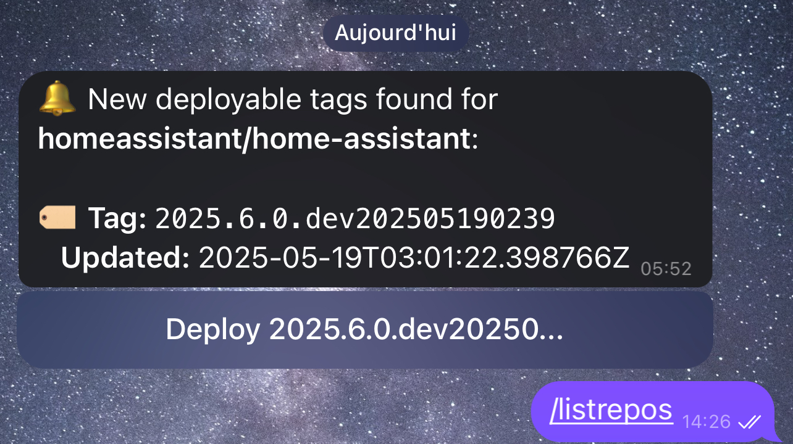

# ReleaseDockerDeployTelegram
Deploy a release from a notify bot on telegram

Need a forgejo instance (or adapt for ci targeted)

# How it works

The script crons each hour to scan new release from docker hub.
If a new tag is created on a docker hub 's repo added a notification will be sent.

An action button under notification will create a tag on a instance forgejo.
With a configurated pipeline, a deployment will be activated by that.

# Start
- Create a directory in base directory project bot_data/
  A json will save data in this directory.

- Create a telegram Bot and get token

- Add token in config.py file

- Start the app

`docker compose up --build -d; docker compose logs -f`

